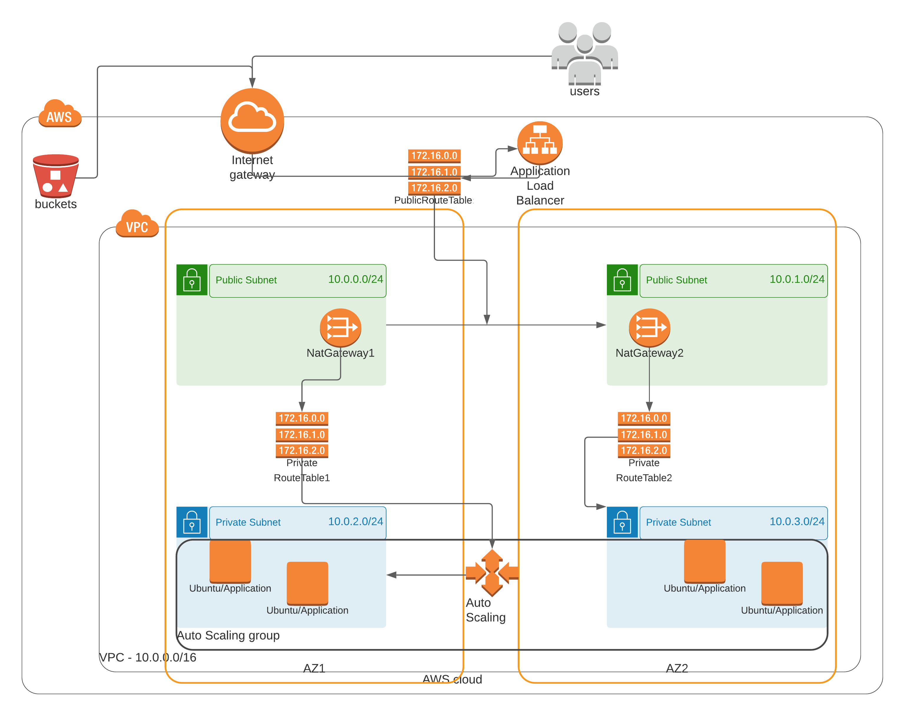

# Deploy a high-availability web app using CloudFormation

## Scenario

Your company is creating an Instagram clone called Udagram. Developers pushed the latest version of their code in a zip file located in a public S3 Bucket.

You have been tasked with deploying the application, along with the necessary supporting software into its matching infrastructure.

This needs to be done in an automated fashion so that the infrastructure can be discarded as soon as the testing team finishes their tests and gathers their results.

## Server specs

You'll need to create a Launch Configuration for your application servers in order to deploy four servers, two located in each of your private subnets. The launch configuration will be used by an auto-scaling group.
You'll need two vCPUs and at least 4GB of RAM. The Operating System to be used is Ubuntu 18. So, choose an Instance size and Machine Image (AMI) that best fits this spec.
Be sure to allocate at least 10GB of disk space so that you don't run into issues. 

## Solution

> ### Diagram

> ### Description

The solution consisted in split the in create s3-bucket, create network and create servers infrastructure in differents stack template files for deployment.

> ### Files structure
1. Create a AWS S3 bucket with file `s3-bucket-stack.yml` or creat a AWS S3 bucket to store Udagram web files with a IAM role.
2. To do upload file `index.html` for AWS S3 bucket create and alter file `server.yml` alter url download s3.
3. The file `network.yml` to deploy all network a stack with the `VPC`, `InternetGateway`, `NatGateway`, `Subnet´s` and `RouteTable`.
4. The file `server.yml` to deploy all server a stack with the website hosts. Also deploy these hosts using `LoadBalancer`, and `AutoScaling`.
5. The file `create.sh` contains shellscript command create stack aws and deploy stack.
6. The file `update.sh` contains shellscript command update stack aws and deploy stack.
7. The file `delete.sh` contains shellscript command delete stack aws command.

> ### Instructions

Use the CloudFormation script:

1. You need to create the website files to upload to S3 Bucket.

2. You need to create the s3 stacks, in a terminal using the file or to go to store and create AWS S3 bucket.
    
    > `utils/create.sh s3-stack s3-bucket-stack.yml s3-parameters.json`

3. You need to create the other stacks described above, in a terminal

    > `create.sh network-stack network-iac/network.yml network-iac/network-parameters.json`
    
    > `create.sh server-stack server.yml server-parameters.json`